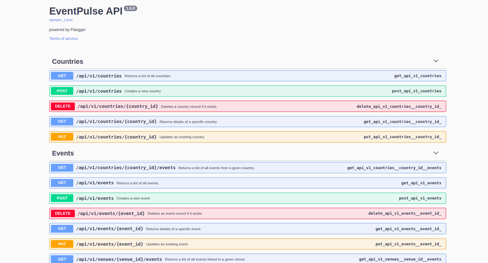

# EventPulse - Backend
### An event management system API built with Flask and SQLAlchemy

The API provides data for the following records

- Users
- Events
- Venues

For endpoints and supported methods, check out the documentation: [https://events.johngaitho.info/apidocs/](https://events.johngaitho.info/apidocs/)



### Setting Up

```shell
git clone git@github.com:johngaitho05/eventpulse-flask.git
cd eventpulse-flask
pip install -r requirements.txt
python -m api.v1.app
```

**Note**: The following environment variables must be set for the API to work properly

#### Cloudinary Credentials
- CLOUDINARY_NAME
- CLOUDINARY_KEY
- CLOUDINARY_SECRET

#### Database Environment
- EVENTPULSE_USER
- EVENTPULSE_PWD
- EVENTPULSE_HOST
- EVENTPULSE_DB